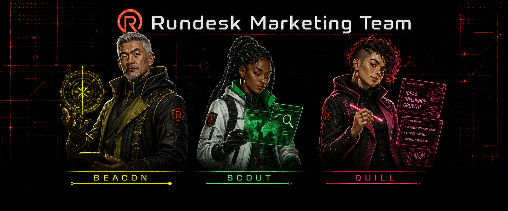

<h1 align="center">
  
</h1>

<p align="center">
  <a href="https://github.com/rundesk-ai/rundesk-team-marketing/actions/workflows/build.yml?query=branch%3Amain"></a>
  <a href="manifest.json"></a>
  <a href="LICENSE"></a>
</p>

<p align="center">
  <a href="#-team"><strong>👥 Team</strong></a>
  &nbsp;·&nbsp;
  <a href="#-skills"><strong>🧠 Skills</strong></a>
  &nbsp;·&nbsp;
  <a href="#-install"><strong>🚀 Install</strong></a>
  &nbsp;·&nbsp;
  <a href="#-development"><strong>🛠️ Development</strong></a>
</p>

A versioned Rundesk marketing team: three specialists, their canonical instructions, the skills they
use, and caller-facing orchestration for combining their work. Specialist guidance stays with this
team; Google, PostHog, and Stripe integrations remain in their reusable integration catalogs and
are declared as dependencies through the [Rundesk CLI](https://github.com/rundesk-ai/rundesk-cli).

## 👥 Team

| Member | Responsibility |
|---|---|
| `beacon` | Owns growth evidence and measurement: opportunity ranking, data verification, experiments, and results. |
| `scout` | Researches markets, customers, competitor businesses, products, and general topics from published sources. |
| `quill` | Writes product requirements, messaging, and other marketing content. |

Each member is an inbound-only specialist. The requesting agent chooses the specialist, retains the
overall outcome, and integrates the returned evidence or artifact.

## 🧠 Skills

### Orchestration

- `managing-marketing-work` — Coordinate multi-specialist marketing outcomes through verified completion.

### Search and acquisition

- `seo` — Audit technical, on-page, structured-data, and AI-search visibility.
- `lead-compliance-gates` — Identify consent, suppression, privacy, and lead-contact gates.

### Research

- `researching-topics` — Find, evaluate, synthesize, and cite reproducible external evidence.
- `researching-markets` — Size a market and characterize demand from counted public data.
- `researching-competitors` — Analyze a rival's business, pricing, claims, and product from public records.
- `researching-customers` — Establish who customers are and what they need from published and primary evidence.

### Measurement and analysis

- `analyzing-growth-data` — Analyze funnels, cohorts, retention, attribution, experiments, segments, forecasts, and realized value.
- `verifying-datasets` — Verify a supplied file or export, and reconcile sources that disagree.

### Product content

- `writing-prds` — Create and validate product requirements, briefs, and feature definitions.

### Integrations

- `google-auth` — Connect and inspect the Google accounts used by this catalog's integrations.
- `google-analytics` — Read bounded GA4 acquisition, audience, event, and ecommerce reports.
- `google-search-console` — Inspect search performance, indexing, and sitemap evidence.
- `google-merchant` — Inspect product eligibility, issues, performance, pricing, and competitive visibility.
- `google-pagespeed-insights` — Measure Lighthouse and field performance for public pages.
- `posthog` — Read bounded product, web, conversion, insight, recording metadata, and HogQL evidence.
- `stripe` — Read account balances, revenue, payouts, charges, subscriptions, and disputes for reconciliation.

This catalog owns and ships every guidance skill above. The Google, PostHog, and Stripe integrations
come from declared catalog dependencies, and `google-auth` arrives with `rundesk-skills-google` as
that catalog's provider declaration.

`managing-marketing-work` is granted to the domain-facing agent that calls the team, never to a team
member: the caller retains the outcome and integrates every specialist return. Every other skill is
granted per member in [`team.json`](team.json). Beacon holds the measurement methods and integrations
that previously belonged to Signal, while Scout remains the owner of cited external research.

## 🚀 Install

Preview first, then confirm.

### Complete team

Install the team, any missing integration catalogs, and three managed agents:

```sh
rundesk teams install https://github.com/rundesk-ai/rundesk-team-marketing --provider <provider>
rundesk teams install https://github.com/rundesk-ai/rundesk-team-marketing --provider <provider> --confirm
```

Team installation creates the agents with their gateways stopped. Start only the agents you want:

```sh
rundesk gateways start <agent>
```

Update the team later with:

```sh
rundesk teams update rundesk-team-marketing --confirm
```

### Skills only

Install only this catalog's guidance skills without creating agents or dependencies:

```sh
rundesk skills install https://github.com/rundesk-ai/rundesk-team-marketing
rundesk skills install https://github.com/rundesk-ai/rundesk-team-marketing --confirm
rundesk skills grant <agent> rundesk-team-marketing/managing-marketing-work
```

You can add the complete team later; its missing integration catalogs will then be installed, while
matching catalogs already present from the same sources will be reused.

## ✅ Requirements

- A Rundesk CLI release that supports schema 2 team catalog dependencies.
- Public GitHub access to this repository.
- For complete-team installation: a provider and unused local names for all three members.
- A configured PostHog profile for live PostHog reads.
- A configured read-only Stripe profile for live Stripe reads.
- A connected Google account and permitted GA4, Merchant Center, or Search Console resources for Google reads.
- A PageSpeed Insights API key for PageSpeed reads.

The Google provider declaration remains owned by `rundesk-skills-google`. Rundesk refuses a
same-named dependency already installed from another source instead of silently replacing it.

Updating an existing installation reconciles Beacon's expanded grants but does not remove an
already installed Signal agent. Retire that agent separately only after preserving any durable
context and following Rundesk's guarded agent-removal workflow.

## 🛠️ Development

Read [AGENTS.md](AGENTS.md), then run the offline gate:

```sh
python3 -m unittest discover -s tests -v
git diff --check
```

See [team validation](docs/guides/team-validation.md) for the lifecycle and member-behavior contract,
and [coverage gaps](docs/concepts/coverage-gaps.md) for the capability limits this catalog does not close.

## 🤝 Contributing

Use the repository templates:

- [Report a bug](.github/ISSUE_TEMPLATE/bug-report.md)
- [Propose a change](.github/ISSUE_TEMPLATE/change-proposal.md)
- [Prepare a pull request](.github/pull_request_template.md)

Keep the README, manifest, tests, team declaration, member instructions, package tree, and
[third-party notices](THIRD_PARTY_NOTICES.md) aligned.

## 📄 License

MIT. Adapted package provenance is recorded in [THIRD_PARTY_NOTICES.md](THIRD_PARTY_NOTICES.md).
