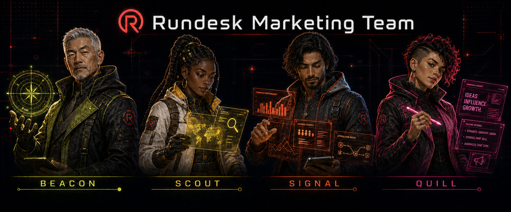

<h1 align="center">
  
</h1>

<p align="center">
  <a href="https://github.com/rundesk-ai/rundesk-team-marketing/actions/workflows/build.yml?query=branch%3Amain"></a>
  <a href="manifest.json"></a>
  <a href="LICENSE"></a>
</p>

<p align="center">
  <a href="#-team"><strong>👥 Team</strong></a>
  &nbsp;·&nbsp;
  <a href="#-skills"><strong>🧠 Skills</strong></a>
  &nbsp;·&nbsp;
  <a href="#-install"><strong>🚀 Install</strong></a>
  &nbsp;·&nbsp;
  <a href="#-development"><strong>🛠️ Development</strong></a>
</p>

A versioned Rundesk marketing team: four specialists, their canonical instructions, the skills they
use, and caller-facing orchestration for combining their work. This repository is both an
installable skill catalog and a team declaration for the [Rundesk CLI](https://github.com/rundesk-ai/rundesk-cli).

## 👥 Team

| Member | Responsibility |
|---|---|
| `beacon` | Maps SEO, AI-search, content, acquisition, and competitor-site opportunities. |
| `scout` | Researches markets, customers, competitors, products, and general topics. |
| `signal` | Analyzes first-party product and marketing data and forecasts. |
| `quill` | Writes product requirements, technical documentation, messaging, and other product content. |

Each member is an inbound-only specialist. The requesting agent chooses the specialist, retains the
overall outcome, and integrates the returned evidence or artifact.

## 🧠 Skills

### Orchestration

- `managing-marketing-work` — Coordinate multi-specialist marketing outcomes through verified completion.

Grant this to the domain-facing agent that calls the team. It is deliberately not granted to a team
member: the caller retains the outcome and integrates every specialist return.

Granted skills are grouped by the outcome they support and the specialist who receives them.
Shared catalog access follows.

### Growth and acquisition — Beacon

- `conversion-landing-pages` — Plan and improve measurable campaign pages and experiments.
- `google-merchant` — Inspect product eligibility, issues, performance, pricing, and competitive visibility.
- `google-pagespeed-insights` — Measure Lighthouse and field performance for public pages.
- `google-search-console` — Inspect search performance, indexing, and sitemap evidence.
- `lead-compliance-gates` — Identify consent, suppression, privacy, and lead-contact gates.
- `seo` — Audit technical, on-page, structured-data, and AI-search visibility.

### Market and customer research — Scout

- `researching-topics` — Find, evaluate, synthesize, and cite reproducible external evidence.

### Measurement and analytics — Signal

- `analyzing-growth-data` — Analyze funnels, cohorts, retention, attribution, experiments, segments, and forecasts.
- `google-analytics` — Read bounded GA4 acquisition, audience, event, and ecommerce reports.
- `posthog` — Read bounded product, web, conversion, insight, recording metadata, and HogQL evidence.

### Product content — Quill

- `writing-prds` — Create and validate product requirements, briefs, and feature definitions.
- `writing-technical-docs` — Create and maintain verified consumer, developer, API, architecture, and troubleshooting documentation.

### Shared Google access

- `google-auth` — Connect and inspect the Google accounts used by this catalog's integrations.

`google-auth` is shipped as the provider declaration that makes the Google integration packages
self-contained; it is not granted to a member by default.

## 🚀 Install

Preview first, then confirm.

### Complete team

Install all skills and four managed agents:

```sh
rundesk teams install https://github.com/rundesk-ai/rundesk-team-marketing --provider <provider>
rundesk teams install https://github.com/rundesk-ai/rundesk-team-marketing --provider <provider> --confirm
```

Team installation creates the agents with their gateways stopped. Start only the agents you want:

```sh
rundesk gateways start <agent>
```

Update the team later with:

```sh
rundesk teams update rundesk-team-marketing --confirm
```

### Skills only

Install the catalog without creating agents:

```sh
rundesk skills install https://github.com/rundesk-ai/rundesk-team-marketing
rundesk skills install https://github.com/rundesk-ai/rundesk-team-marketing --confirm
rundesk skills grant <agent> rundesk-team-marketing/managing-marketing-work
```

This installs only the skills. You can add the complete team later without reinstalling them.

## ✅ Requirements

- A Rundesk CLI release that supports team catalogs.
- Public GitHub access to this repository.
- For complete-team installation: a provider and unused local names for all four members.
- A configured PostHog profile for live PostHog reads.
- A connected Google account and permitted GA4, Merchant Center, or Search Console resources for Google reads.
- A PageSpeed Insights API key for PageSpeed reads.

This catalog carries its own Google OAuth provider declaration. Do not install it alongside another
catalog that declares the same `google` provider; Rundesk refuses ambiguous provider ownership.
Read each integration package's `references/cli.md` before configuring access.

## 🛠️ Development

Read [AGENTS.md](AGENTS.md), then run the offline gate:

```sh
python3 -m unittest discover -s tests -v
python3 skills/posthog/scripts/posthog.d/test-posthog.py -q
python3 skills/google-auth/scripts/google-auth.d/test-google-auth.py -q
python3 skills/google-analytics/scripts/google-analytics.d/test-google-analytics.py -q
python3 skills/google-merchant/scripts/google-merchant.d/test-google-merchant.py -q
python3 skills/google-pagespeed-insights/scripts/google-pagespeed-insights.d/test-google-pagespeed-insights.py -q
python3 skills/google-search-console/scripts/google-search-console.d/test-google-search-console.py -q
git diff --check
```

See [team validation](docs/team-validation.md) for the lifecycle and member-behavior contract.

## 🤝 Contributing

Use the repository templates:

- [Report a bug](.github/ISSUE_TEMPLATE/bug-report.md)
- [Propose a change](.github/ISSUE_TEMPLATE/change-proposal.md)
- [Prepare a pull request](.github/pull_request_template.md)

Keep the README, manifest, tests, team declaration, member instructions, package tree, and
[third-party notices](THIRD_PARTY_NOTICES.md) aligned.

## 📄 License

MIT. Adapted package provenance is recorded in [THIRD_PARTY_NOTICES.md](THIRD_PARTY_NOTICES.md).
